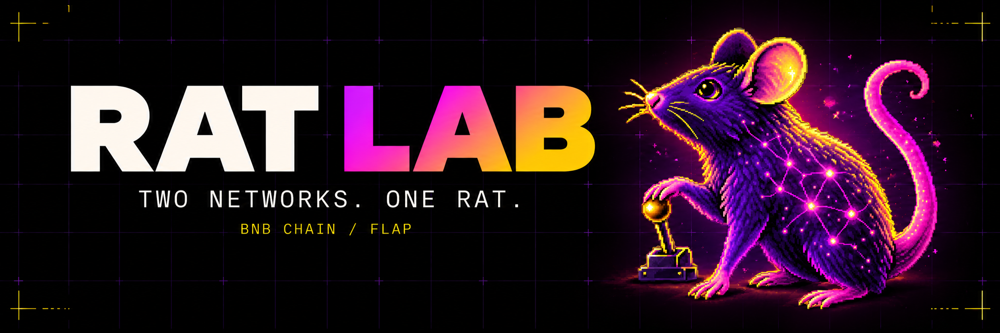

<a href="https://rat-lab.fun" title="Visit the RAT LAB website"></a>

<div align="center">

**A virtual rat, two trained policies, eight targets, and a verifiable BNB Chain launch.**

[**Website ↗**](https://rat-lab.fun) &nbsp;·&nbsp; [**Observe ↗**](https://rat-lab.fun/live) &nbsp;·&nbsp; [**Challenge ↗**](https://rat-lab.fun/challenge) &nbsp;·&nbsp; [**Buyback ledger ↗**](https://rat-lab.fun/buyback) &nbsp;·&nbsp; [**X ↗**](https://x.com/gouyi420)

</div>

---

RAT LAB explores a simple question: what can learned behavior do when its actions have a checkable consequence? R-01 is a virtual rodent in MuJoCo. One artificial network steers its head to move a cursor; another coordinates its body to press a lever. Eight hits on RAT LAB's virtual control surface advanced a **preset** BNB Chain / Flap launch plan. The operator chose the token details and spending limit.

| The release | Where to check it |
| :--- | :--- |
| **Live website** | [rat-lab.fun](https://rat-lab.fun) |
| **Token** | [RAT on Flap](https://flap.sh/bnb/0xC090F3c8825b1ca46ae85Cf5D809f191764B7777) · [`0xC090…B7777`](https://bscscan.com/token/0xC090F3c8825b1ca46ae85Cf5D809f191764B7777) |
| **Transaction** | [View the confirmed BSC transaction](https://bscscan.com/tx/0xeb45642bc52d7a2e71ee780fac9a13eff0e713fe22636d5445315326711525b7) |
| **Brain and session** | [Download the public release record](https://rat-lab.fun/release.json) for the SHA-256 fingerprints and eight-hit result |
| **Updates** | [@gouyi420 on X](https://x.com/gouyi420) |

### The experiment continues

| Experience | What is running |
| :--- | :--- |
| [**Observe R-01**](https://rat-lab.fun/live) | Our own recurring Aim Eight inference sessions, cursor playback, replay checks and downloadable records. Fixed trained policies; no claim of ongoing learning. |
| [**Human vs. rat**](https://rat-lab.fun/challenge) | Race a verified recording in two synchronized lanes. See every target split, finish ahead or behind R-01, and export your local result. The hosted site includes recorded 3D body motion. |
| [**BNB buyback rehearsal**](https://rat-lab.fun/buyback) | Unique verified hits generate an illustrative paper allocation. **No funded wallet or real purchases.** Includes a block-specific token-tax snapshot. |

The observer is a separate, read-only service with no signer. It retains 24 run summaries; its simulation window resets on restart. [Runtime, deployment and verification details →](docs/LIVE_LAB.md)

### Explore the code

- **[Website](src/PublicApp.tsx)** — public experiment story, mechanism interaction, eight-target sequence, and evidence desk.
- **[Live lab](src/LabApp.tsx)** — observation, proof inspection and a transparent simulation ledger.
- **[Challenge](src/components/Challenge.tsx)** — shared target rules, local timing and result export.
- **[Observer](observer/engine.py)** — isolated neural inference and deterministic replay verification.
- **[Launch plan](server/launch_plan.py)** — binds the operator's parameters and spending limit to one transaction intent.
- **[Local signer](server/autolaunch.py)** — submits only after the target sequence, replay, and plan checks succeed.
- **[Publisher](server/publish.py)** — checks the receipt and replay before producing the static release bundle.
- **[Architecture](docs/ARCHITECTURE.md)** · **[Validation](docs/FLAP_VALIDATION.md)** · **[Third-party provenance](THIRD_PARTY.md)**

### Preview this public-source website

```sh
npm ci
npm run dev
# http://127.0.0.1:5173
```

To preview the confirmed release state locally, save the [public JSON record](https://rat-lab.fun/release.json) as `public/release.json`, then run `npm run build:public` or refresh the dev server. Without that file, the evidence desk correctly shows an unpublished state. The public-source subject view displays an original static mascot illustration. The 2D observation surface plays our own recorded cursor data and connects to the hosted observer. The duel uses a synchronized 2D cursor fallback in this public-source build; the hosted site adds the separately supplied 3D renderer.

> The hosted website also displays a **labeled upstream reference replay**. That replay, the adapted 3D viewer, original model assets, trained weights, and upstream source are omitted from this repository because the upstream Labrat repository has no repository-wide redistribution license. See [THIRD_PARTY.md](THIRD_PARTY.md) for the exact boundary. A neural session requires separately obtained compatible upstream components.

### Source and license

Original RAT LAB code and artwork in this repository are MIT licensed. The upstream virtual rodent research is credited to [Labrat](https://github.com/LabratDevRH/labrat) and [DeepMind's `dm_control`](https://github.com/google-deepmind/dm_control). Referenced projects retain their own terms. RAT LAB is independent of Labrat, DeepMind, BNB Chain, and Flap.

<sub>The token launch is complete. The code here documents the experiment and does not call for another launch.</sub>
